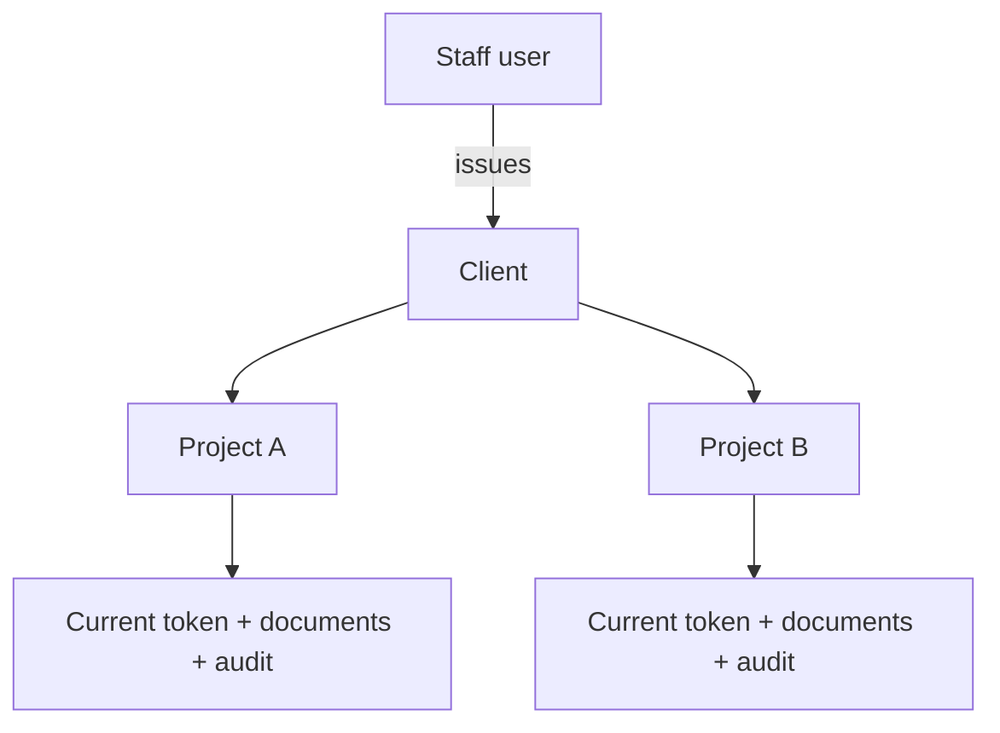

# Sino Secure — Operational Handoff

Current architecture and release instructions for `sinosecure.eu`. This supersedes
the original marketing-only handoff: the site now has authentication, a database,
private document storage, staff accounts, clients, projects and customer upload
tokens.

## 1. Product surfaces

| Route | Audience | Purpose |
| --- | --- | --- |
| `/` | Public | Marketing site |
| `/contact#enquiry` | Public | Creates or matches a client, opens a new project and issues its upload token |
| `/secure-upload/[code]` | Customer | Project-specific document upload |
| `/underwriting-desk` | Staff | Login, clients, projects, proposals, tokens, documents and users |

Private routes are excluded from indexing and sent with `Cache-Control: no-store`.

## 2. Domain model



A client is identified by a normalized primary business email and may have multiple
projects. A project contains its own name, reference, proposal metadata, status,
expiry and current token digest. Rotating the token updates only that project and
immediately invalidates its previous link.

Project rows retain contact/organisation snapshots so later client-detail changes do
not rewrite historical correspondence.

## 3. Roles

| Capability | `super_admin` | `admin` | `staff` |
| --- | --- | --- | --- |
| Sign in | Yes | Yes | Yes |
| Create/select clients | Yes | Yes | Yes |
| Create project token | Yes | Yes | Yes |
| Send proposal | Yes | Yes | Yes |
| Review projects/documents/audit | Yes | Yes | Yes |
| Add, disable, reset or assign users | Yes | No | No |
| View notification configuration | Yes | No | No |

The first account is created with `UNDERWRITING_ADMIN_KEY` and receives
`super_admin`. The bootstrap key is never a day-to-day credential or a customer
token. The last active super administrator cannot be demoted or disabled.

## 4. Environment configuration

| Variable | Use |
| --- | --- |
| `UNDERWRITING_ADMIN_KEY` | One-time super-admin bootstrap; minimum 16 characters |
| `UNDERWRITING_NOTIFY_EMAIL` | Explicit recipient of enquiry and upload alerts |
| `RESEND_API_KEY` | Direct outbound email |
| `PROPOSAL_FROM_EMAIL` | Verified From identity for alerts and proposals |
| `PROPOSAL_BCC_EMAIL` | Optional proposal archive copy |
| `URL` | Netlify-provided canonical origin for upload links |

Approved production value: `UNDERWRITING_NOTIFY_EMAIL=underwriting@sinosecure.eu`.

No enquiry recipient is hard-coded. Netlify Forms archives `sino-underwriting` and
`sino-document-activity`. A separate email notification may also exist under
**Netlify → Forms → Form notifications**, but that dashboard value cannot be read
from the repository. The deterministic application recipient is
`UNDERWRITING_NOTIFY_EMAIL`, displayed to the super admin under **Team & settings**.

If a Netlify Forms notification and direct Resend notification point to the same
mailbox, remove one notification route to prevent duplicates while retaining the form
archive.

## 5. Database and migrations

Core tables:

- `underwriting_users` — password digest, role, status and login state
- `underwriting_sessions` — hashed staff browser sessions
- `underwriting_clients` — one row per normalized customer email
- `underwriting_projects` — many projects per client; one current token digest each
- `underwriting_documents` — private Blob metadata and SHA-256 checksum
- `underwriting_events` — append-oriented security and matter audit trail

Migrations are in `netlify/database/migrations` and are automatically applied by
Netlify before a deploy is published. The two current follow-on migrations:

- promote one existing administrator to `super_admin` and constrain valid roles;
- create the client table, backfill existing projects deterministically by normalized
  email, add project names and enforce `client_id`.

The client migration includes a compatibility trigger so the previous deployed build
can still open an enquiry during Netlify's short migration-to-publication handover.
Do not manually apply the migrations to production before publishing the matching
code.

## 6. Authentication and user lifecycle

- Passwords: scrypt, per-user random salt, minimum 12 characters.
- Staff session: random 256-bit token; only SHA-256 digest stored.
- Cookie: `HttpOnly`, `Secure`, `SameSite=Lax`, 12-hour expiry.
- Failed logins: IP-digest throttling and audit events.
- New users: one-time generated password, mandatory password change.
- Password change: invalidates every other session.
- Disable/reset: invalidates all sessions immediately.
- User APIs: server-enforced `super_admin`; hiding the UI is not the permission check.

## 7. Client/project token workflow

1. Staff signs in at `/underwriting-desk`.
2. Under **Client token / proposal**, select an existing client or create a new one.
3. Enter the required project/proposal name, coverage, expiry and internal note.
4. Choose:
   - **Send proposal** — opens the project, mints its token and sends/drafts the email.
   - **Create client token** — opens the same project/token without sending email.
5. Copy the plaintext token shown once. The database stores only its digest.
6. The client uploads to the project link. Files and events cannot cross project IDs.
7. Use **Matters → Issue a new access code** to rotate; the former token fails
   immediately.

The client register shows project counts so a returning client is selected instead of
created again.

## 8. Public enquiry workflow

1. Validate name, business email and risk description; reject the honeypot.
2. Normalize the business email and reuse or create the client.
3. Open a new project below that client.
4. Generate a reference and 80-bit Crockford-base32 upload token.
5. Store the token digest and return the one-time plaintext code/link.
6. Archive the enquiry through Netlify Forms and alert the explicit notification
   mailbox when configured.

The general form must not accept documents. Files use the code-gated portal.

## 9. Document boundary

- Private Netlify Blob store: `underwriting-documents`, strong consistency.
- Maximum 25 MB per file, 40 stored files per project.
- 3 MB browser chunks keep requests below synchronous Function limits.
- Extension allow-list for documents, spreadsheets, presentations, images, archives
  and email files.
- Server reassembles, validates byte length and records SHA-256.
- Desk downloads require a live staff session and use
  `Content-Type: application/octet-stream` plus `Content-Disposition: attachment`.
- Upload and download actions are audited.

## 10. Code map

| File | Responsibility |
| --- | --- |
| `db/schema.ts` | Users, sessions, clients, projects, documents and events |
| `lib/auth.ts` | Passwords, sessions, throttling and role helpers |
| `lib/email.ts` | Resend boundary and notification configuration |
| `lib/portal.ts` | Client matching, project/token creation and resolution |
| `lib/proposal.ts` | Proposal text, mailto fallback and direct delivery |
| `lib/underwriting.ts` | Token format, uploads, responses and desk notifications |
| `netlify/functions/uw-auth.mts` | Setup, login, password and user APIs |
| `netlify/functions/uw-desk.mts` | Client/project/proposal/token/document staff APIs |
| `netlify/functions/uw-portal.mts` | Public enquiry and customer upload APIs |
| `src/components/desk/` | Authenticated operator UI |
| `public/__forms.html` | Netlify's static form detector definitions |

## 11. Deployment and smoke test

Run locally:

```bash
npm ci
npm run typecheck
npm run build
```

After the deploy preview is ready:

1. Confirm the database migrations applied.
2. Sign in as the promoted or newly created super admin.
3. Confirm **Team & settings** shows the intended notification email and `Ready`.
4. Add a temporary staff user; set its permanent password.
5. Confirm staff cannot access `/api/underwriting/desk/users` (`403`).
6. Create one client and two named projects beneath it.
7. Confirm the client register reports two projects and Matters keeps them separate.
8. Upload a harmless PDF to project A; confirm project B shows no document.
9. Rotate project A's token; confirm old code fails and new code succeeds.
10. Confirm the alert mailbox receives one enquiry/upload notification and Forms has
    the corresponding archive entries.
11. Disable the temporary user and confirm its session ends.

Do not use a Netlify personal access token, `UNDERWRITING_ADMIN_KEY`, staff session
cookie or Resend key as a client upload token. These are separate credential domains.
